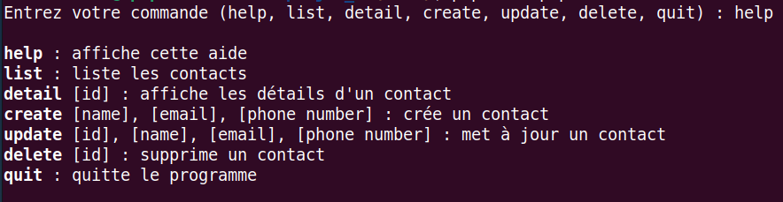

# Projet 2

## [Gestionnaire de carnet d’adresses](https://github.com/nutbreaker/projet_3)

### _OpenClassrooms_

_Par André M._

---

## Résumé du Projet

Ce projet consiste en une application en **ligne de commande (CLI)** pour gérer un carnet d'adresses.

**Objectif :** Mise en pratique de concepts de la programmation orientée objet (POO) en PHP.

---

## Livrables

- Une application en ligne de commande
- Fonctionnalités implémentées :
  - `list` : Lister les contacts
  - `detail` : Afficher le détail d'un contact
  - `create` : Créer un nouveau contact
  - `update` : Mettre à jour un contact
  - `delete` : Supprimer un contact
  - `help` : Afficher l'aide
  - `quit` : Quitte le programme

---

## Architecture du Projet

- **`DBConnect`** : gère la connexion à la base de données SQLite
- **`Contact`** : représente le modèle de données pour un contact
- **`ContactManager`** : contient les opérations de lecture/écriture avec la base de données (CRUD)
- **`Command`** : contient la logique applicative pour chaque commande
- **`main.php`** : le point d'entrée de l'application qui gère l'interaction avec l'utilisateur

---

## Étapes de Réalisation (1/3)

- [**Étape 1 : Initialisez le projet**](https://github.com/nutbreaker/projet_3/commit/5007a780)
  - création de `main.php` pour lire les arguments de la ligne de commande
- [**Étape 2 : Initialisez la base de données**](https://github.com/nutbreaker/projet_3/commit/25e9049)
  - création du schéma SQL ainsi que la base de donnée
- [**Étape 3 : Créez la commande `list`**](https://github.com/nutbreaker/projet_3/commit/df12520)
  - première implémentation qui permettra d'afficher tous les contacts

---

## Étapes de Réalisation (2/3)

- [**Étape 4 : Créez vos premières classes**](https://github.com/nutbreaker/projet_3/commit/c7dbb26)
  - création de la classe `DBConnect` pour la connexion
  - création de la classe `Contact` représentant un contact
  - création de la classe `ContactManager` interagissant avec la DB
- [**Étape 5 : Finalisez de la commande `list`**](https://github.com/nutbreaker/projet_3/commit/75beaab)
  - refactorisation pour utiliser `ContactManager`
- [**Étape 6 : Centralisation de la logique**](https://github.com/nutbreaker/projet_3/commit/c6d883d)
  - création de la classe `Command` pour gérer les différentes commandes

---

## Étapes de Réalisation (3/3)

- [**Étape 7 : Ajout des commandes CRUD**](https://github.com/nutbreaker/projet_3/commit/154be28)
  - implémentation de `detail`, `create`, et `delete`.
  - ajout des méthodes correspondantes dans `ContactManager`
- [**Étape Bonus : Finalisation**](https://github.com/nutbreaker/projet_3/commit/ca8a172)
  - ajout de la commande `help`
  - ajout de la commande `update`
  - ajout de la commande `quit`

---

## Conclusion

- **Résumé du travail accompli :** Développement d'une application CLI.
- **Compétences mises en oeuvre :**
  - programmation orientée objet
  - interaction avec une base de données

### Notes
 _cf. [OC solution](https://github.com/OpenClassrooms-Student-Center/PHP-P5-exercice-solution)_

- Couplage fort [Command](https://github.com/OpenClassrooms-Student-Center/PHP-P5-exercice-solution/blob/65227617386f1097cf9687626eb7ec8b4f43305a/Command.php#L14-L17), [ContactManager](https://github.com/OpenClassrooms-Student-Center/PHP-P5-exercice-solution/blob/65227617386f1097cf9687626eb7ec8b4f43305a/ContactManager.php#L16-L20) vs injection de dépendances [Command](https://github.com/nutbreaker/projet_3/blob/3c05881fd4023cf216a74cd944eac494089a9f3e/Command.php#L8-L11), [ContactManager](https://github.com/nutbreaker/projet_3/blob/3c05881fd4023cf216a74cd944eac494089a9f3e/ContactManager.php#L7-L9)
- Pratique à améliorer:
  - [Command](https://github.com/OpenClassrooms-Student-Center/PHP-P5-exercice-solution/blob/main/Contact.php#L36-L44), [ContactManager](https://github.com/OpenClassrooms-Student-Center/PHP-P5-exercice-solution/blob/65227617386f1097cf9687626eb7ec8b4f43305a/ContactManager.php#L33-L35) vs [ContactManager](https://github.com/nutbreaker/projet_3/blob/3c05881fd4023cf216a74cd944eac494089a9f3e/ContactManager.php#L12-L17)
  - [2 requêtes](https://github.com/OpenClassrooms-Student-Center/PHP-P5-exercice-solution/blob/65227617386f1097cf9687626eb7ec8b4f43305a/ContactManager.php#L64-L72) vs [INSERT avec RETURNING](https://github.com/nutbreaker/projet_3/issues/1)
